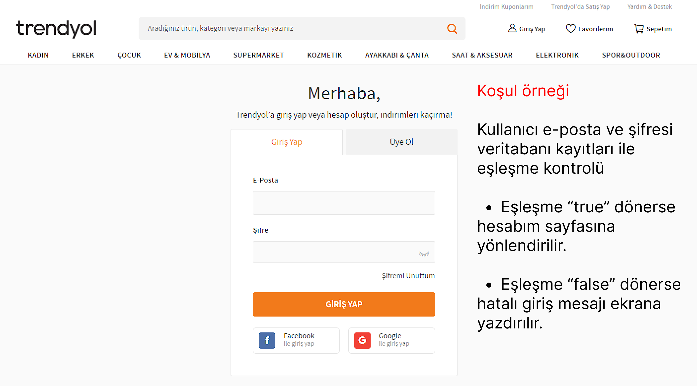
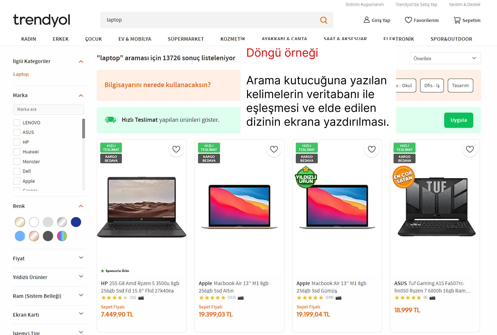

## Ödev 1

> Trendyol sitesine girdiğiniz zaman bu sitede kullanılan şartlı bloklara ve döngülerle yapılmış alanlara örnekler bulunuz.

#### Şartlı Bloklar

- Kullanıcı e-posta ve şifresi veritabanı kayıtları ile eşleşme kontrolü.
  - Eşleşme "true" dönerse hesabım sayfasına yönlendirilir.
  - Eşleşme "false" dönerse hata mesajı ekrana yazdırılır.
  

#### Döngüler

- Arama kutucuğuna yazılan kelimelerin veritabanı ile eşleşmesi ve elde edilen ürün dizisinin ekrana yazdırılması.

